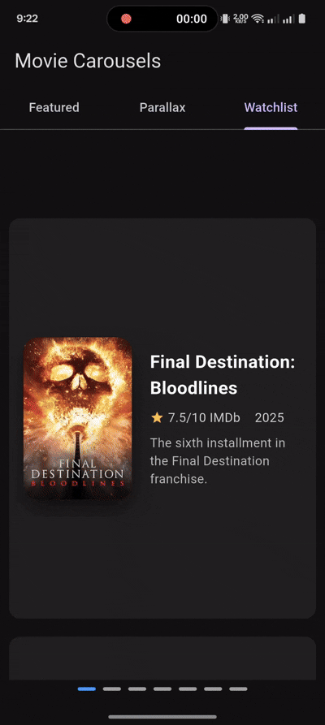

# Animated Hero Carousel

A highly customizable and animated hero carousel for Flutter, designed to create engaging and visually appealing user interfaces. This package provides smooth hero animations, various indicator types, and pre-built styles to quickly integrate stunning carousels into your application.

## 📸 Screenshots

| Netflix Style                                                              | Parallax Effect                                                            | Vertical Watchlist                                                                 |
| -------------------------------------------------------------------------- | -------------------------------------------------------------------------- | ---------------------------------------------------------------------------------- |
|           |              |         |

## ✨ Features

*   **Hero Animations:** Seamless and smooth hero transitions between carousel items and their detail screens.
*   **Customizable Styles:** Choose from pre-built styles (e.g., Netflix, Instagram, Spotify) or define your own to match your app's aesthetic.
*   **Multiple Indicator Types:** Support for `dot`, `bar`, and `worm` indicators to enhance user navigation.
*   **Autoplay and Looping:** Configure the carousel to automatically advance and loop infinitely for a dynamic experience.
*   **Drag to Expand:** Implement intuitive drag-to-expand detail screens, similar to popular mobile app patterns.
*   **Parallax Effect:** Add a subtle parallax scrolling effect to your carousel items, creating a sense of depth and immersion.
*   **Flexible Item Building:** Provides a flexible `itemBuilder` that gives you access to the `PageController` for advanced custom effects like parallax.
*   **External Control:** Use a `HeroCarouselController` to programmatically control the carousel's state.

## 🚀 Getting Started

To use this package, add `animated_hero_carousel` as a dependency in your `pubspec.yaml` file:

```yaml
dependencies:
  animated_hero_carousel: ^1.0.0 # Use the latest version
```

Then, run `flutter pub get` to fetch the package.

## 📖 Usage

Here's a basic example of how to use `AnimatedHeroCarousel`:

```dart
import 'package:animated_hero_carousel/animated_hero_carousel.dart';
import 'package:flutter/material.dart';

class MyCarouselPage extends StatelessWidget {
  final List<String> items = ['Movie A', 'Movie B', 'Movie C'];

  @override
  Widget build(BuildContext context) {
    return Scaffold(
      appBar: AppBar(title: const Text('My Awesome Carousel')),
      body: Center(
        child: SizedBox(
          height: 300, // Adjust height as needed
          child: AnimatedHeroCarousel<String>(
            items: items,
            // Defines the widget for each carousel item
            itemBuilder: (context, item, index, pageController) {
              return Card(
                margin: const EdgeInsets.symmetric(horizontal: 8.0),
                child: Center(
                  child: Text(
                    item,
                    style: const TextStyle(fontSize: 24),
                  ),
                ),
              );
            },
            // Defines the detail screen that opens on tap
            detailBuilder: (item, index) {
              return Scaffold(
                appBar: AppBar(title: Text('Detail for $item')),
                body: Center(
                  child: Text('This is the detail screen for $item'),
                ),
              );
            },
            // A unique tag for the Hero transition
            heroTagBuilder: (item, actualIndex, pageViewIndex) =>
                'hero_tag_${item}_$actualIndex',
            // Apply a pre-built style
            style: CarouselStyle.netflix(),
            // Enable indicators
            showIndicators: true,
            indicatorType: IndicatorType.worm,
            // Enable autoplay and looping
            autoplay: true,
            loop: true,
          ),
        ),
      ),
    );
  }
}
```

## ⚙️ API Reference

### `AnimatedHeroCarousel` Properties

| Parameter             | Type                                                                              | Description                                                                                                                              |
| --------------------- | --------------------------------------------------------------------------------- | ---------------------------------------------------------------------------------------------------------------------------------------- |
| `items`               | `List<T>`                                                                         | **Required.** The list of data items to display in the carousel.                                                                         |
| `itemBuilder`         | `Widget Function(BuildContext, T, int, PageController)`                           | **Required.** A builder function that returns the widget for each carousel item. Provides access to the `PageController` for custom effects. |
| `detailBuilder`       | `Widget Function(T, int)`                                                         | **Required.** A builder function that returns the widget for the detail screen, which is shown when an item is tapped.                    |
| `heroTagBuilder`      | `String Function(T, int, int)`                                                    | **Required.** A function that returns a unique hero tag for each item to enable the transition animation.                                |
| `scrollDirection`     | `Axis`                                                                            | The axis along which the carousel scrolls. Defaults to `Axis.horizontal`.                                                                |
| `initialIndex`        | `int`                                                                             | The initial page index to display. Defaults to `0`.                                                                                      |
| `spacing`             | `double?`                                                                         | The spacing between carousel items. If a `style` is provided, this value will be overridden by the style's spacing.                     |
| `onItemTap`           | `Function(T)?`                                                                    | A callback function that is invoked when a carousel item is tapped.                                                                      |
| `showIndicators`      | `bool?`                                                                           | Whether to display the page indicators. If a `style` is provided, this value will be overridden. Defaults to `true`.                    |
| `viewportFraction`    | `double?`                                                                         | The fraction of the viewport that each page should occupy. If a `style` is provided, this value will be overridden.                     |
| `animationDuration`   | `Duration?`                                                                       | The duration of the page transition animation. If a `style` is provided, this value will be overridden.                                  |
| `animationCurve`      | `Curve?`                                                                          | The curve of the page transition animation. If a `style` is provided, this value will be overridden.                                     |
| `loop`                | `bool`                                                                            | Whether the carousel should loop infinitely. Defaults to `false`.                                                                        |
| `autoplay`            | `bool`                                                                            | Whether the carousel should autoplay. Defaults to `false`.                                                                               |
| `autoplayInterval`    | `Duration`                                                                        | The time interval between autoplay transitions. Defaults to `3 seconds`.                                                                 |
| `controller`          | `HeroCarouselController?`                                                         | An optional controller to programmatically control the carousel.                                                                         |
| `enableDragToExpand`  | `bool`                                                                            | Whether to enable the drag-to-expand functionality on the detail screen. Defaults to `false`.                                            |
| `expandedHeight`      | `double?`                                                                         | The height of the detail screen when fully expanded. **Required** if `enableDragToExpand` is `true`.                                     |
| `collapsedHeight`     | `double?`                                                                         | The height of the detail screen when collapsed. **Required** if `enableDragToExpand` is `true`.                                          |
| `dragHandleBuilder`   | `Widget Function(BuildContext)?`                                                  | An optional builder for a custom drag handle on the expandable detail screen.                                                            |
| `style`               | `CarouselStyle?`                                                                  | A pre-defined or custom `CarouselStyle` to apply to the carousel. Overrides individual styling properties.                               |
| `indicatorType`       | `IndicatorType`                                                                   | The type of indicator to display. Can be `dot`, `bar`, or `worm`. Defaults to `dot`.                                                     |
| `parallaxFactor`      | `double?`                                                                         | The parallax effect factor. A value between `0.0` and `1.0` is recommended. If a `style` is provided, this value will be overridden.      |

## 🕹️ Using the `HeroCarouselController`

You can control the carousel programmatically by attaching a `HeroCarouselController`.

```dart
// 1. Create a controller
final _controller = HeroCarouselController();

// 2. Attach it to the carousel
AnimatedHeroCarousel(
  controller: _controller,
  // ... other properties
)

// 3. Use the controller to navigate
_controller.next(
  duration: const Duration(milliseconds: 300),
  curve: Curves.ease,
);

_controller.previous(
  duration: const Duration(milliseconds: 300),
  curve: Curves.ease,
);

_controller.animateToPage(2);
```

## 🎨 Customization

### `CarouselStyle`

You can use pre-built styles or create your own.

**Pre-built Styles:**

*   `CarouselStyle.netflix()`
*   `CarouselStyle.instagram()`
*   `CarouselStyle.spotify()`

**Custom Style:**

```dart
AnimatedHeroCarousel(
  style: const CarouselStyle(
    viewportFraction: 0.9,
    spacing: 8.0,
    showIndicators: false,
    parallaxFactor: 0.3,
    animationDuration: Duration(milliseconds: 400),
    animationCurve: Curves.easeOut,
  ),
  // ... other properties
)
```

### `IndicatorType`

Choose from three indicator types:

*   `IndicatorType.dot` (default)
*   `IndicatorType.bar`
*   `IndicatorType.worm`

## 🤝 Contributing

Contributions are welcome! If you have a feature request, bug report, or want to contribute code, please feel free to:

1.  Open an issue on the [GitHub repository](https://github.com/your-username/animated_hero_carousel/issues).
2.  Fork the repository and submit a pull request.

## 📄 License

This project is licensed under the MIT License - see the [LICENSE](LICENSE) file for details.
